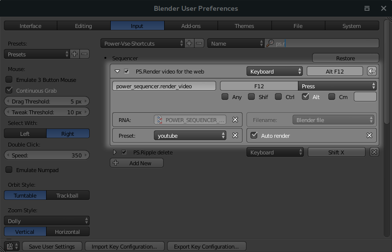

## Render videos for the web

Applies a rendering preset (specified in the preferences) and starts the rendering.

### Render the video 

1. Place the mouse cursor over the Video Sequencer Editor
2. Press <kbd>Alt</kbd><kbd>F12</kbd> (shortcut for `PS.Render video for the web` operator)

Blender uses only one CPU core for the rendering. This means that 
it's possible to do other things during the rendering: you can also open another Blender
instance and start editing a new video, withouth major slowdowns.

### Change rendering preferences

1. Press <kbd>Ctrl</kbd><kbd>Alt</kbd><kbd>U</kbd> to access *User Preferences*
2. Select the *Input tab*
3. Search for `PS.Render video for the web`
4. Click the arrow to expand details of the keymap

You will see something like: 

#### Preset 

The preset contains rendering options such as resolution, container, and codecs.

At the moment there are only two presets available.

| Preset      | Resolution | Container | Video codec | Audio codec |
| -           | -          | -         | -           | -           |
| **youtube** | 1080p      | mp4       | h264        | AAC         |
| **twitter** | 720p       | mp4       | h264        | AAC         |

#### Filename 

Filename of the rendered video. It can be one of:
- **Blender file**: the name of the main *.blend* file
- **Current scene**: the name of the current [Blender scene](https://docs.blender.org/manual/en/dev/data_system/scenes/introduction.html)
- **Folder**: the name of the folder containing the main *.blend* file 

#### Auto render 

If checked (it's the default setting), the `PS.Render video for the web` operator will automatically start the rendering.

If unchecked, it will only update rendering settings, but it will not start rendering: to start the render, 
you will need to click on the *Animation* button in the *Properties Editor*. 
